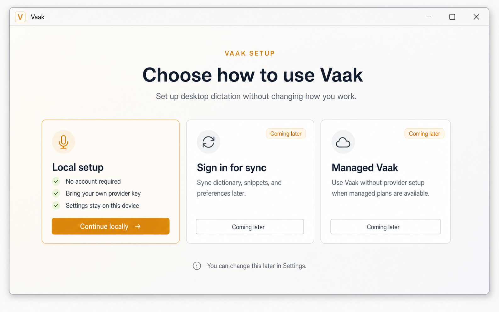
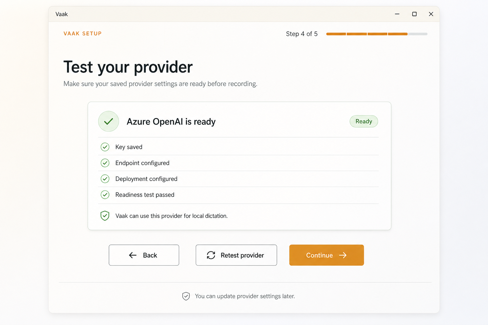
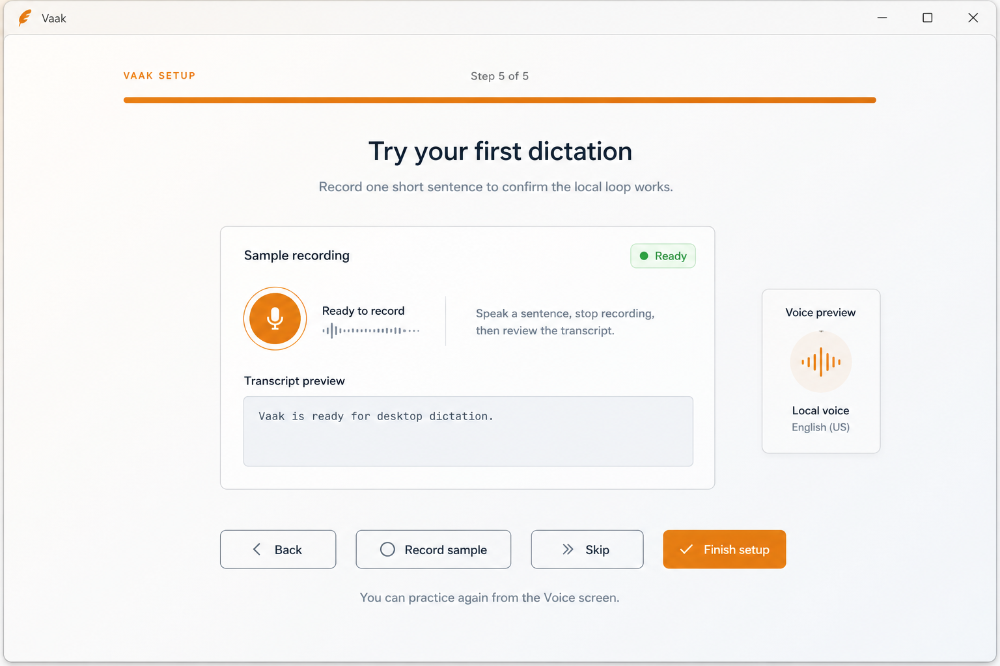

# Vaak

Open-source, local-first voice input for desktop workflows on Windows.

Vaak turns speech into text and inserts it into the app you were already using.
It is built for people who want a serious desktop voice workflow without making
a hosted account or a single vendor the center of the product.

The early Windows preview is for users who want to try local-first dictation,
bring their own speech provider key, and help shape the product while it is
still moving quickly.

## Why Try Vaak

- Open-source desktop app, not a closed hosted recorder.
- Local-first by default: no Vaak account is required for local dictation.
- Bring your own provider key and choose the speech service you trust.
- API keys are stored through the app's secure storage path, not plain browser
  storage.
- Built as a production desktop tool with Tauri, React, TypeScript, and Rust.
- Optional sync, team, billing, and managed cloud features can come later
  without blocking the local product.

## Screenshots







## Download

Download the latest Windows preview installer:
[Vaak-Windows-Setup.exe](https://github.com/ContextGridTechnologies/vaak/releases/latest/download/Vaak-Windows-Setup.exe)

Checksum:
[Vaak-Windows-Setup.exe.sha256](https://github.com/ContextGridTechnologies/vaak/releases/latest/download/Vaak-Windows-Setup.exe.sha256)

Unsigned macOS preview builds for testers:
[Vaak-macOS-AppleSilicon-Preview.dmg](https://github.com/ContextGridTechnologies/vaak/releases/latest/download/Vaak-macOS-AppleSilicon-Preview.dmg)
and
[Vaak-macOS-Intel-Preview.dmg](https://github.com/ContextGridTechnologies/vaak/releases/latest/download/Vaak-macOS-Intel-Preview.dmg)

All release builds are available from the
[GitHub releases page](https://github.com/ContextGridTechnologies/vaak/releases).

Report bugs or request workflow improvements from the
[GitHub issue chooser](https://github.com/ContextGridTechnologies/vaak/issues/new/choose).

Early desktop builds are unsigned. Windows may show a SmartScreen warning, and
macOS testers may need to allow the app from Privacy & Security until signing is
added.

## What Works Today

Vaak is in early active development. The current focus is the local
bring-your-own-provider dictation loop:

- install the Windows desktop app
- continue without a Vaak account
- configure a speech provider in Settings
- store provider credentials through secure local storage
- test provider readiness before dictating
- capture microphone input
- transcribe speech through the selected provider
- insert dictated text into the focused desktop app

The core product should not require a Vaak account or hosted backend.

## Provider Support

Vaak uses one internal provider interface with separate adapters. Current and
near-term speech provider work includes OpenAI, Azure OpenAI, AssemblyAI,
Deepgram, Groq, ElevenLabs, and Smallest AI. Additional providers should fit
behind the same internal boundary.

## Project Direction

Vaak is voice input infrastructure for desktop work:

- open-source desktop app
- local-first workflow by default
- bring-your-own transcription and model providers
- provider adapters behind one internal provider interface
- optional cloud features for sync, managed usage, billing, and teams later
- production-grade desktop UX rather than a demo shell

### Windows SmartScreen

The current Windows installer is unsigned. If Windows shows "Windows protected
your PC" with `Publisher: Unknown publisher`, that is expected for this early
release. It means Windows cannot verify a code-signing publisher identity yet;
it does not mean the installer failed.

Before running the installer, you can verify the downloaded file checksum:

```powershell
Get-FileHash .\Vaak-Windows-Setup.exe -Algorithm SHA256
```

Compare the result with the matching `Vaak-Windows-Setup.exe.sha256` release
asset.

## Repository Layout

```text
.
+-- apps/
|   +-- desktop/      # Tauri desktop app with React, TypeScript, and Rust
+-- packages/        # Shared packages and future reusable UI/shared code
+-- docs/            # Product, architecture, security, and roadmap docs
+-- scripts/         # Local project tooling
+-- output/          # Local generated artifacts, not committed
```

Useful docs:

- `docs/ROADMAP.md`
- `docs/DICTATION_EXPERIENCE_FUTURE_SCOPE.md`
- `docs/POSITIONING.md`
- `docs/OPEN_SOURCE_PRODUCT_BASELINE.md`
- `docs/PROVIDER_STRATEGY.md`
- `docs/MODEL_CALLING_RETRY_BASE.md`
- `docs/PROVIDER_SPECIFIC_RETRY.md`
- `docs/ARCHITECTURE.md`
- `docs/DEVELOPMENT.md`
- `docs/SECURITY.md`

## Prerequisites

- Node.js 20.19.0 or newer
- npm 10 or newer
- Rust toolchain through rustup
- Visual Studio Build Tools 2022 on Windows, including C++ build tools and a
  Windows SDK

## Getting Started

Install the desktop dependencies from the repo root:

```powershell
npm run install:desktop
```

Start the Vite development server:

```powershell
npm run dev
```

This serves the React app on `http://127.0.0.1:1420`.

For native desktop behavior such as window control, hotkeys, focused-field
capture, and text insertion, run the Tauri shell:

```powershell
npm run tauri dev
```

If PowerShell has not reloaded the Rust install path yet, the repo's Tauri
launcher prepends `%USERPROFILE%\.cargo\bin` automatically.

## Windows Packaging

Local Windows packaging defaults to NSIS rather than WiX/MSI. Install NSIS with
`winget install NSIS.NSIS`, then run `npm run tauri:build` from the repo root.

Expected outputs:

- NSIS installer: `apps/desktop/src-tauri/target/release/bundle/nsis/`
- Direct desktop binary: `apps/desktop/src-tauri/target/release/vaak-desktop.exe`

Public GitHub releases publish the Windows installer as
`Vaak-Windows-Setup.exe`, plus matching Apple Silicon and Intel preview macOS
`.app.zip` and `.dmg` assets. Each download has a matching `.sha256` checksum
file.

Tagged releases also build `Vaak.msix` for Microsoft Store submission and
upload it as the `Vaak-Microsoft-Store-MSIX` workflow artifact. Store publishing
remains a separate Partner Center step; see `docs/DEVELOPMENT.md`.

MSI is optional later if you install WiX with
`winget install WiXToolset.WiXToolset` and re-enable an MSI-specific packaging
path.

## Verification

Run the smallest meaningful check for your change. The main repo commands are:

```powershell
npm run typecheck
npm run lint
npm run test
npm run build
```

For Rust or Tauri backend changes, also run:

```powershell
cd apps/desktop/src-tauri
cargo check
```

## Contributing

Vaak is not ready for broad public contribution yet, but the codebase should be
kept contributor-readable now.

When changing the project:

- Keep local dictation usable without login or hosted services.
- Keep provider-specific code behind provider adapters.
- Store BYO API keys through secure storage helpers, not browser storage.
- Put reusable UI in shared components instead of one-off feature markup.
- Keep public copy aligned with open-source, local-first desktop workflows.
- Avoid committing generated screenshots, scratchpads, or local debug output.

See `AGENTS.md` and `docs/DEVELOPMENT.md` for more detailed development
guidance.

## License

Apache-2.0. See `LICENSE`.
